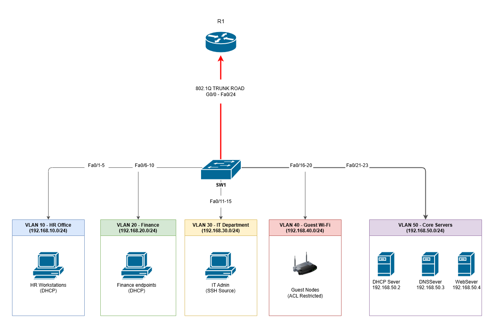

# Enterprise Office Network

A secure enterprise office network designed and implemented using Cisco Packet Tracer.

This project simulates a small business network featuring VLAN segmentation, inter-VLAN routing, DHCP, DNS, SSH, ACLs, and basic switch security. The goal was to design a scalable and secure network while applying Cisco CCNA networking concepts.

---

## Project Objectives

- Design an enterprise office network
- Segment departments using VLANs
- Configure Router-on-a-Stick for inter-VLAN routing
- Deploy centralized DHCP services
- Configure DNS name resolution
- Host an internal company website
- Secure remote administration using SSH
- Restrict network access using ACLs
- Implement basic switch security
- Document and troubleshoot the network

---

## Network Topology



---

## Departments

| VLAN | Department  | Network         |
| ---- | ----------- | --------------- |
| 10   | HR          | 192.168.10.0/24 |
| 20   | Finance     | 192.168.20.0/24 |
| 30   | IT          | 192.168.30.0/24 |
| 40   | Guest       | 192.168.40.0/24 |
| 50   | Server Room | 192.168.50.0/24 |

| Device                   | IP Address   | Purpose               |
| ------------------------ | ------------ | --------------------- |
| Router Gateway (VLAN 10) | 192.168.10.1 | Default Gateway       |
| Router Gateway (VLAN 20) | 192.168.20.1 | Default Gateway       |
| Router Gateway (VLAN 30) | 192.168.30.1 | Default Gateway       |
| Router Gateway (VLAN 40) | 192.168.40.1 | Default Gateway       |
| Router Gateway (VLAN 50) | 192.168.50.1 | Default Gateway       |
| DHCP Server              | 192.168.50.2 | Dynamic IP Assignment |
| DNS Server               | 192.168.50.3 | Name Resolution       |
| Web Server               | 192.168.50.4 | Internal Website      |
| Switch Management        | 192.168.30.2 | SSH Management        |

---

## Technologies Used

- Cisco Packet Tracer
- Cisco IOS CLI
- VLANs
- IEEE 802.1Q Trunking
- Router-on-a-Stick
- DHCP
- DNS
- HTTP
- SSH
- Extended ACLs
- Port Security

---

## Features

### Network Segmentation

- Department separation using VLANs
- Router-on-a-Stick inter-VLAN routing

### Network Services

- Centralized DHCP Server
- Internal DNS Server
- Internal Web Server

### Security

- SSH remote management
- Password encryption
- ACL implementation
- Port Security
- Disabled unused switch ports
- MOTD security banner

---

## Testing Performed

✔ Inter-VLAN connectivity

✔ DHCP address assignment

✔ DNS hostname resolution

✔ Internal website access

✔ SSH remote login

✔ ACL verification

✔ Port security validation

---

## Repository Structure

```
Enterprise-Office-Network/

├── configs/
│   ├── Router.txt
│   └── Switch.txt
│
├── docs/
│   ├── IPAddressing.xlsx
│   └── Troubleshooting.md
│
├── screenshots/
│   ├── topology.png
│   ├── dhcp.png
│   ├── dns.png
│   ├── ssh.png
│   └── webpage.png
│
├── Enterprise-Office-Network.pkt
├── CHANGELOG.md
├── LICENSE
└── README.md
```

---

## Lessons Learned

This project strengthened my understanding of:

- Enterprise network design
- VLAN segmentation
- Inter-VLAN routing
- DHCP relay (ip helper-address)
- DNS configuration
- SSH management
- ACL implementation
- Cisco switch security
- Network troubleshooting

---

## Future Improvements

- Dual-switch topology
- Redundant links
- EtherChannel
- OSPF
- Firewall integration
- Syslog server
- NTP server
- IPv6 implementation

---

## Author

**Khulekani Thabethe**

Computer Science Student

GitHub:
https://github.com/love-eskom

LinkedIn:
https://www.linkedin.com/in/gcinikhaya-thabethe-33167b274/
